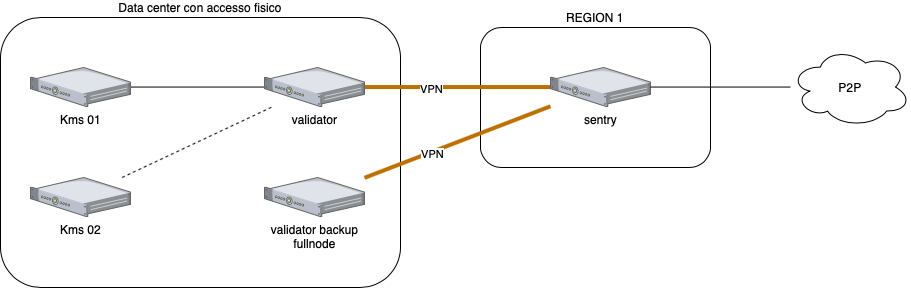
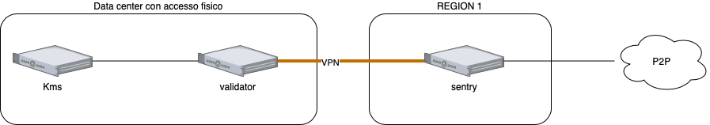
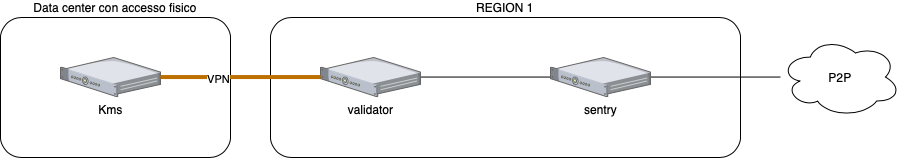
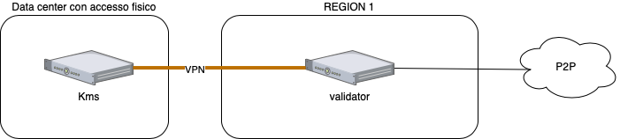
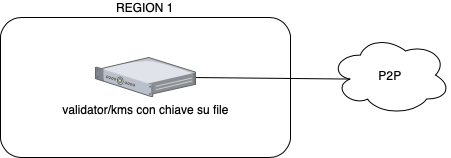

# Note generali sulla configurazione KMS-nodo validatore

## Concetti generali
Il concetto generale di un nodo validatore è quello di validare ogni blocco che viene rilasciato sulla chain.    
Per fare ciò il validatore esegue dei calcoli matematici sui dati inviati dalle varie transazioni.
I dati risultanti dalle varie transazioni devono essere uguali per tutti i validatori.     
Questi dati poi vengono firmati con la chiave di firma in possesso del validatore stesso, che in tal modo li verifica.    
La chiave di firma può risiedere all'interno di un semplice file o in un HSM (Hardware Security Module).    
Se la chiave viene compromessa anche l'integrità della chain viene compromessa, fino a portare in alcuni casi al blocco della chain stessa.    
Se più dei 2/3 (due terzi) dei nodi validatori risulta con le chiavi compromesse la chain si bloccherà, perché si arriverà a creare una situazione in cui tutti i nodi coinvolti verranno messi in jail e quindi disattivati.     
Lo scenario difficilmente si può verificare, ma comunque, è necessario mantenere in sicurezza le proprie chiavi, ed è per questo che si dovrebbe adottare un HSM, in maniera che le chiavi private siano protette all'interno del modulo.

La chain è costituita da varie tipologie di nodi e da vari attori. 

## Separazione kms-nodo validatore

Premesso che è possibile comunque installare il kms dal nodo validatore la separazione dei due componenti consente di agire in maniera più sicura e robusta nella gestione.     
1. Se il nodo validatore deve essere spostato per qualsiasi tipo di esigenza, si può creare un semplice full-node da un'altra parte, spegnere il nodo attualmente funzionante, spostare il puntamento del kms e cambiare la configurazione del full-node. Se invece la macchina è un tuttuno deve essere tutto predisposto in precedenza, avendo anche la necessità di avere un HSM aggiuntivo, o in alternativa togliere l'HSM dal nodo (e quindi un certo periodo di off-line per il nodo) e spostarlo su quello nuovo. Tutte le operazioni, specialmente se il nodo è in cloud, potrebbero risultare complicate
2. La compromissione del nodo validatore non compromette anche le chiavi, dato che si trovano su un sistema separato. Il kms ha accesso al nodo validatore su una specifica porta, mentre il nodo validatore non ha accesso a nessuna accesso del kms.
3. E' più semplice realizzare una ridondanza di chiavi: se si dovesse creare un nodo ridondato comunque quest'ultimo dovrebbe avere tutta la logica del nodo preesistente.

## Esempi di strutture
I nodi validatori possono essere di vario tipo, come anche si può vedere dall'immagine "Blockchain topology". Di seguito vengono presentate alcuni esempi di strutture non comunque esaustive.    
### Doppio kms/Doppio validatore/Nodi realy/Nodi Sentry

Sono presenti 2 kms che hanno lo stesso materiale crittografico. In caso di guasto di uno dei due subentra il secondo.   
E' presente un nodo validatore attivo, e un nodo validatore di backup che funziona solo come full node. Non accede allo stesso materiale crittografico del nodo attivo.   
Nel caso di guasto del nodo principale viene attivato il validatore di backup "girando" il puntamento dei kms al nodo validatore di riserva e cambiando le configurazioni di tale nodo in maniera che possa leggere il materiale crittografico dal kms.    
Il collegamento con altri nodi in cloud viene realizzato attraverso vpn.   
I sentry sono gli unici nodi esposti alla rete pubblica e quindi alla rete p2p.   

La configurazione garantisce protezione grazie ai relay, che esistono su una rete privata accessibile solo dalla rete vpn e non sono esposti direttamente su internet. Un accesso indesiderato di qualche tipo sui sentry non pregiudica il validator.  
A meno di esigenze particolari questa configurazione non dovrebbe essere implementata: il costo in infrastuttura potrebbe essere proibitivo e complica molto la gestione.   

Un malfunzionamento di uno dei sentry non pregiudica il funzionamento della struttura del validatore.   

### Doppio kms/Doppio validatore/Nodi Sentry

Sono presenti 2 kms che hanno lo stesso materiale crittografico. In caso di guasto di uno dei due subentra il secondo.   
E' presente un nodo validatore attivo, e un nodo validatore di backup che funziona solo come full node. Non accede allo stesso materiale crittografico del nodo attivo.   
Nel caso di guasto del nodo principale viene attivato il validatore di backup "girando" il puntamento dei kms al nodo validatore di riserva e cambiando le configurazioni di tale nodo in maniera che possa leggere il materiale crittografico dal kms.    
Il collegamento con altri nodi in cloud viene realizzato attraverso vpn.   
I sentry sono gli unici nodi esposti alla rete pubblica e quindi alla rete p2p.   
Un'intrusione sui sentry node potrebbero pregiudicare il funzionamento del validatore (DDOS).    

Un malfunzionamento di uno dei sentry non pregiudica il funzionamento della struttura del validatore.   

### Doppio kms/Doppio validatore/Un solo Nodo Sentry

Sono presenti 2 kms che hanno lo stesso materiale crittografico. In caso di guasto di uno dei due subentra il secondo.   
E' presente un nodo validatore attivo, e un nodo validatore di backup che funziona solo come full node. Non accede allo stesso materiale crittografico del nodo attivo.   
Nel caso di guasto del nodo principale viene attivato il validatore di backup "girando" il puntamento dei kms al nodo validatore di riserva e cambiando le configurazioni di tale nodo in maniera che possa leggere il materiale crittografico dal kms.    
Il collegamento con altri nodi in cloud viene realizzato attraverso vpn.   
I sentry sono gli unici nodi esposti alla rete pubblica e quindi alla rete p2p.   
Un'intrusione sui sentry node potrebbero pregiudicare il funzionamento del validatore (DDOS).    

Un malfunzionamento del sentry pregiudica il funzionamento della struttura del validatore.   

### Un kms/Un validatore/Un solo Nodo Sentry

E' presente un solo kms.  Un malfunzionamento di quest'ultimo pregiudica il funzionamento di tutta la struttura del nodo. 
E' presente un solo nodo validatore attivo. Un malfunzionamento del nodo validatore pregiudica il funzionamento di tutta la struttura del nodo.    
Il collegamento con altri nodi in cloud viene realizzato attraverso vpn.   
I sentry sono gli unici nodi esposti alla rete pubblica e quindi alla rete p2p.   
Un'intrusione sui sentry node potrebbero pregiudicare il funzionamento del validatore (DDOS).    

Un malfunzionamento del sentry pregiudica il funzionamento della struttura del validatore.   

### Un kms/Un validatore in cloud/Un solo Nodo Sentry

E' presente un solo kms.  Un malfunzionamento di quest'ultimo pregiudica il funzionamento di tutta la struttura del nodo. 
E' presente un solo nodo validatore attivo. Un malfunzionamento del nodo validatore pregiudica il funzionamento di tutta la struttura del nodo.    
Il nodo validatore è in cloud. L'instabilità della connessione VPN pregiudica il funzionamento del nodo validataore.  
Un'intrusione sui sentry node potrebbero pregiudicare il funzionamento del validatore (DDOS).  
Il validatore potrebbe essere sensibile a intrusioni esterne anche direttamente, ossia senza passare dal sentry.     

Un malfunzionamento del sentry pregiudica il funzionamento della struttura del validatore.   

### Un kms/Un validatore in cloud

E' presente un solo kms. Un malfunzionamento di quest'ultimo pregiudica il funzionamento di tutta la struttura del nodo. 
E' presente un solo nodo validatore attivo. Un malfunzionamento del nodo validatore pregiudica il funzionamento di tutta la struttura del nodo.    
Il nodo validatore è in cloud ed è esposto alla rete globale. L'instabilità della connessione VPN pregiudica il funzionamento del nodo validataore. Il nodo validatore è prono ad attacchi esterni e intrusioni.     

### Validatore in cloud

E' presente un solo nodo validatore attivo. Un malfunzionamento del nodo validatore pregiudica il funzionamento di tutta la struttura del nodo.    
Il nodo validatore è in cloud ed è esposto alla rete globale. Il nodo validatore è prono ad attacchi esterni e intrusioni.     
Il materiale crittografico è in chiaro (file). Un accesso al nodo validatore potrebbe esporre il materiale crittografico. Se il materiale crittografico viene compromesso il nodo potrebbe incorrere in doppia segnatura con conseguente eliminazione del nodo dai validatori attivi. Di conseguenza il nodo dovrà essere ricostruito con nuove chiavi.   

