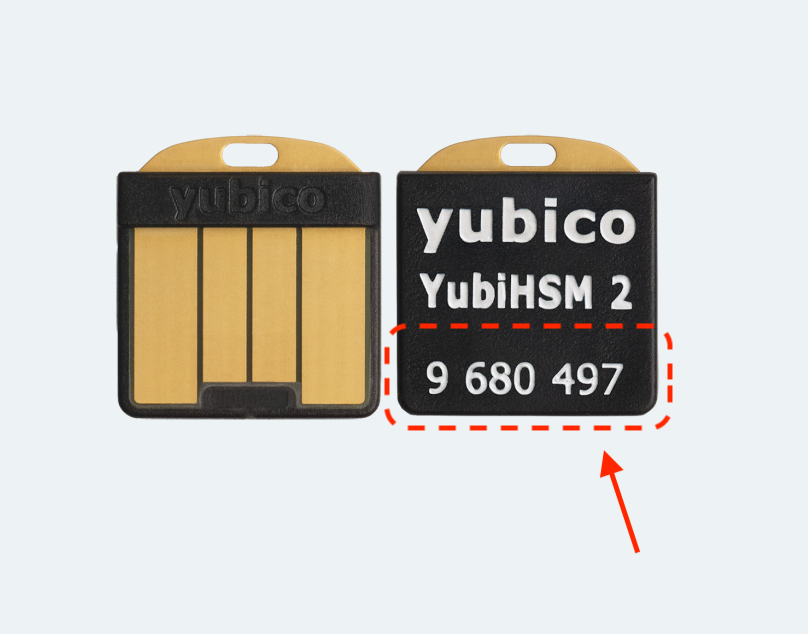

# KMS

## Oggetto della guida
In questa sezione viene indicato come installere un kms basati su yubihsm e tmkms con chavi multiple.   
**Si precisa che si tratta di linee guida, ed è essenziale capire il processo che qui viene sintetizzato**

La guida si sviluppa in questa maniera

1. Breve presentazione dell'infrastruttura
1. Lista componenti necessari e presentazione degli stessi
3. Configurazione ambiente
3. Procedura di installazione del software necessario
4. Verifica e messa a punto 


## Infrastruttura

L'infrastruttura attesa è l'installazione dello yubiHSM 2 su un server collegato in rete, via lan privata o vpn, al nodo validatore vero e proprio.

Qualsiasi aggiunta di ridondanza al modello è assolutamente consigliato. Nella fattispecie possono essere implmentati componentistiche indicate di seguito. Queste indicazioni non sono vincolanti e qualsiasi altra strategia che garantisca una buona disponibilità delle chiavi di firma è ben accetta.

1. Doppia interfaccia di rete eventualmente da mettere in bonding e utilizzo di un doppio switch
2. Server di riserva a caldo di un ulteriore kms: un kms aggiuntivo può essere messo in funzionamento e aggiunto al nodo validatore. Un nodo può avere più di un sistema che fornisce il materiale crittografico, a non ci deve esssere più di un nodo che accede allo stesso materiale crittografico.
3. Doppio alimentatore per i macchinari coinvolti, utile per la manutenzione elettrica.
4. Sistemi di continuità elettrica.

Naturalmente alcuni di questi componenti sono già forniti di base dalle sale server professionali.

## Componenti necessari all'installazione

L'ambiente più testato per l'installazione del kms sono ubuntu 18.04 e YubiHSM2.

Per il funzionamento dell'hsm queste sono le caratteristiche minime per la macchina 
* Processore `x86_64`
* Ram minimo `2Gb` ma consigliato `4Gb`: sistema + software
* Interfaccia di rete minimo `100mbit`
* Spazio disco minimo `10Gb`. Preferibile avere un disco in raid1 se possibile.
* Presa `usb`. Preferibile eventualmente una scheda di usb interna ([questa scheda è già stata testata e funziona](https://www.amazon.it/gp/product/B07TDCZXRJ/ref=ppx_yo_dt_b_search_asin_title?ie=UTF8&psc=1)) per i seguenti motivi
  * Lo yubiHSM è più protetto
  * C'è spesso un problema nel riavvio del server che ospiterà lo yubiHSM: non viene più alimentato correttamente al boot e deve essere estratto e reinserito.

Questa guida fa uso di [`YubiHSM2`](https://www.yubico.com/it/product/yubihsm-2/).

*In linea teorica è possibile utilizzare anche [`ledger S`](https://shop.ledger.com/products/ledger-nano-s), ma i test effettuati hanno dato esito negativo ed inoltre non è adatto a un utilizzo intensivo e dopo alcuni mesi deve essere sostituita.*

## Configurazione ambiente

L'installazione del sistema operativo e il suo aggiornamento sono fuori dallo scopo di questa guida e delle guide relative all'argomento possono essere trovate sul [sito stesso di Ubuntu](https://ubuntu.com/tutorials/install-ubuntu-server#1-overview).

I comandi indicati di seguito devono essere eseguiti come **root.**

Inserire lo yubiHSM nella presa usb preposta. Se il dispositivo è stato utilizzato precedentemente, **e il suo contenuto non serve**, eseguire un reset tenendo premuto più di 3 secondi la ghiera metallica quando il dispositivo viene inserito. 

Prendere nota del seriale dello yubiHSM




Se non si è già utente di root eseguire

```bash
sudo su - 
```

Lanciare i comandi per creare l’utente con cui eseguire le operazioni

```bash
mkdir /data_tmkms
useradd -m -d /data_tmkms/tmkms -G sudo tmkms -s /bin/bash
echo 'SUBSYSTEMS=="usb", ATTRS{product}=="YubiHSM", GROUP=="tmkms"' >> /etc/udev/rules.d/10-yubihsm.rules
reboot
```

**NB**: potrebbe essere necessario riavviare più volte il server per applicare. Togliere reinserire il dispositivo usb se non venisse visto dopo il reboot. 

**NB2**: chiunque abbia dimestichezza con i sistemi operativi e la gestione degli utenti può scegliere di eseguire l'installazione di un utente in maniera differente. Per il resto della guida si prenderà per acquisito che l'utente tmkms avrà la home installat in `/data_tmkms/tmkms`

## Procedura di installazione

Da questo momento in poi agiremo come utente **tmkms**. Tutti i comandi che necessitano di privilegi di root dovranno essere lanciati con **sudo**

### Installazione strumenti per la compilazione

Installazione compilatore c and git tools e di libusb necessari per il funzionamento dell’**HSM**

```bash
sudo apt install gcc git libusb-1.0-0-dev -y
```

Installazione rust: linguaggio per la compilazione del **TmKms**

```bash
export RUSTFLAGS=-Ctarget-feature=+aes,+ssse3
curl --proto '=https' --tlsv1.2 -sSf https://sh.rustup.rs | sh
# Scegliere "opzione 1"
source $HOME/.cargo/env
```

Installazione pkg-config

```bash
sudo apt install pkg-config -y
```

### Installazione **TmKms**

```bash
cd $HOME
cargo install tmkms --features=yubihsm --locked --force
```

Controllo funzionamento
```bash
tmkms version
```

La versione al momento della stesura di questa guida è la `0.10.0`

### Installazione software YubiHSM

Devono essere installati degli strumenti aggiuntivi propri dello yubiHSM per poter gestire il collegamento come servizio e non direttamente su usb.

Installare le utility di `yubico`

```bash 
wget https://developers.yubico.com/YubiHSM2/Releases/yubihsm2-sdk-2021-03-ubuntu1804-amd64.tar.gz
tar zxf yubihsm2-sdk-2021-03-ubuntu1804-amd64.tar.gz
sudo apt install ./yubihsm2-sdk/*.deb
```

Attivare il service

```bash 
sudo tee /etc/systemd/system/yubihsm-connector.service > /dev/null <<EOF
[Unit]
Description=YubiHSM connector
Documentation=https://developers.yubico.com/YubiHSM2/Component_Reference/yubihsm-connector/
After=network-online.target
Wants=network-online.target systemd-networkd-wait-online.service

[Service]
Restart=on-abnormal
User=tmkms
Group=tmkms
ExecStart=/usr/bin/yubihsm-connector -c /etc/yubihsm-connector.yaml
PrivateTmp=true
ProtectHome=true
ProtectSystem=full

[Install]
WantedBy=multi-user.target
EOF


systemctl enable yubihsm-connector.service
systemctl start yubihsm-connector.service
```

Un servizio sulla porta `12345` dovrebbe attivarsi. Questo servizio servirà alle configurazioni del tmkms per poter funzionare.


### Creazione configurazione base

Creeremo una configurazione di base per inizializzare lo yubiHSM.

Creare le seguenti cartelle

```bash
cd /data_tmkms/tmkms
mkdir -p kms/base
mkdir -p kms/base/secrets
mkdir -p kms/base/states
```

Creare una cartella per i template

```bash
cd /data_tmkms/tmkms
mkdir -p kms/templates
```

Creare la configurazione di base `/data_tmkms/tmkms/kms/base/base.toml`. 
**NB**: questa configurazione serve unicamente per il reset dello yubiHSM e alcuni dati e anche alcuni file collegati non hanno alcuna funzionalità se non quella di correttezza formale di del file.

```toml
[[chain]]
id = "xxxx"
key_format = { type = "bech32", account_key_prefix = "did:com:", consensus_key_prefix = "did:com:valconspub" }
state_file = "/data_tmkms/tmkms/kms/base/states/state.json"

[[validator]]
addr = "tcp://10.1.1.254:26658"
chain_id = "xxxx"
reconnect = true
secret_key = "/data_tmkms/tmkms/kms/base/secrets/secret_connection.key"
protocol_version = "v0.33" 

[[providers.yubihsm]]
adapter = { type = "usb" }
auth = { key = 1, password_file = "/data_tmkms/tmkms/kms/password" }
keys = [{ chain_ids = ["xxxx"], key = 1, type = "consensus" }]
serial_number = "9876543210"
```

**Attenzione**: cambiare `serial_number = "9876543210"` con il valore della propria chiave yubiHSM. Il serial_number comunque può essere omesso: in linea teorica serve nel caso si stia utilizzando via usb più di una chiave yubiHSM collegato al server.

Creare la password all'interno del file `/data_tmkms/tmkms/kms/password`

```bash
printf "password" > /data_tmkms/tmkms/kms/password
```

Creare un template per generare la chiave segreta di connessione

```bash
tmkms init /data_tmkms/tmkms/kms/templates/base
```

Copiare la chiave segreta
```bash
cd /data_tmkms/tmkms
cp kms/templates/base/secrets/kms-identity.key \
  kms/base/secrets/secret_connection.key
```

A questo punto siamo pronti per inizializzare lo yubiHSM

```bash
tmkms yubihsm setup -c /data_tmkms/tmkms/kms/base/base.toml
```

Un output di questo tipo dovrebbe apparire. Su due righe separate saranno presenti 24 parole che costituiranno la nuova password dello yubiHSM

```
This process will *ERASE* the configured YubiHSM2 and reinitialize it:
- YubiHSM serial: 9876543210
Authentication keys with the following IDs and passwords will be created:
- key 0x0001: admin:

double section release consider diet pilot flip shell mother alone what fantasy
much answer lottery crew nut reopen stereo square popular addict just animal

- authkey 0x0002 [operator]:  kms-operator-password-1k02vtxh4ggxct5tngncc33rk9yy5yjhk
- authkey 0x0003 [auditor]:   kms-auditor-password-1s0ynq69ezavnqgq84p0rkhxvkqm54ks9
- authkey 0x0004 [validator]: kms-validator-password-1x4anf3n8vqkzm0klrwljhcx72sankcw0
- wrapkey 0x0001 [primary]:   21a6ca8cfd5dbe9c26320b5c4935ff1e63b9ab54e2dfe24f66677aba8852be13

Are you SURE you want erase and reinitialize this HSM? (y/N):
```

Confermare quando viene richiesto di reinizializzare il dispositivo con `y` per procedere all'inizializzazione dello yubiHSM


```
21:08:09 [WARN] factory resetting HSM device! all data will be lost!
21:08:11 [WARN] deleting temporary setup authentication key from slot 65534

Success reinitialized YubiHSM (serial: 9876543210)
```

Salvare la nuova password del file 

```bash
printf "double section release consider diet pilot flip shell mother alone what fantasy much answer lottery crew nut reopen stereo square popular addict just animal" >/data_tmkms/tmkms/kms/password
```
**ATTENZIONE**: se la password non viene salvata in questo momento lo yubiHSM non potrà essere utilizzato e l'unico modo di fare un reset è quello di farlo manualmente.

Nel caso si volesse fare un `restore` di una precedente installazione è necessario eseguire un recover con le 24 parole. Questa procedura potrebbe essere necessaria nel caso si debba replicare le chiavi su un nuovo yubi o nel caso si voglia resettare lo yubi avendo comunque la possibilità di reimportare le chiave esportate crittate
```bash
tmkms yubihsm setup -c /data_tmkms/tmkms/kms/base/base.toml --restore
```

Verrà quindi richiesto di inserire il mnemonic con le 24 parole.

### Creazione configurazioni nodi

Per ogni chiave, quindi in pratica per ogni validatore che si vuole collegare al kms, deve essere creata una configurazione.

Creeremo le configurazioni all'interno della cartella `/data_tmkms/tmkms/kms/commercio`.

```bash
cd /data_tmkms/tmkms
mkdir -p kms/commercio
mkdir -p kms/commercio/secrets
mkdir -p kms/commercio/states
```


Vogliamo creare le configurazioni per i seguenti nodi validatori

**Nodo1**
* Ip del ndo validatore: `10.1.1.1`
* Chain: `commercio-2_2`
* Id chiave: `1`
* state_file: `/data_tmkms/tmkms/kms/commercio/states/node1.json`
* secret_key: `/data_tmkms/tmkms/kms/commercio/secrets/node1.key`

**Nodo2**
* Ip del ndo validatore: `10.1.1.2`
* Chain: `commercio-2_2`
* Id chiave: `2`
* state_file: `/data_tmkms/tmkms/kms/commercio/states/node2.json`
* secret_key: `/data_tmkms/tmkms/kms/commercio/secrets/node2.key`

Creeare i due template, solo per ottenere le secret key di collegamento

```bash
tmkms init /data_tmkms/tmkms/kms/templates/node1
tmkms init /data_tmkms/tmkms/kms/templates/node2
```

Creare le configurazioni per i nodi

**Node1**
Creare il file `/data_tmkms/tmkms/kms/commercio/node1.toml` con i seguenti dati

```toml
[[chain]]
id = "commercio-2_2"
key_format = { type = "bech32", account_key_prefix = "did:com:", consensus_key_prefix = "did:com:valconspub" }
state_file = "/data_tmkms/tmkms/kms/commercio/states/node1.json"

[[validator]]
addr = "tcp://10.1.1.1:26658"
chain_id = "commercio-2_2"
reconnect = true
secret_key = "/data_tmkms/tmkms/kms/commercio/secrets/node1.key"
protocol_version = "v0.33" 

[[providers.yubihsm]]
adapter = { type = "http", addr = "tcp://127.0.0.1:12345" }
auth = { key = 1, password_file = "/data_tmkms/tmkms/kms/password" }
keys = [{ chain_ids = ["commercio-2_2"], key = 1, type = "consensus" }]
serial_number = "9876543210"
```

**Node2**

Creare il file `/data_tmkms/tmkms/kms/commercio/node2.toml` con i seguenti dati

```toml
[[chain]]
id = "commercio-2_2"
key_format = { type = "bech32", account_key_prefix = "did:com:", consensus_key_prefix = "did:com:valconspub" }
state_file = "/data_tmkms/tmkms/kms/commercio/states/node2.json"

[[validator]]
addr = "tcp://10.1.1.2:26658"
chain_id = "commercio-2_2"
reconnect = true
secret_key = "/data_tmkms/tmkms/kms/commercio/secrets/node2.key"
protocol_version = "v0.33" 

[[providers.yubihsm]]
adapter = { type = "http", addr = "tcp://127.0.0.1:12345" }
auth = { key = 1, password_file = "/data_tmkms/tmkms/kms/password" }
keys = [{ chain_ids = ["commercio-2_2"], key = 2, type = "consensus" }]
serial_number = "9876543210"
```


**Da notare**

1. Nella sezione `[[providers.yubihsm]]` abbiamo indicato nel parametro `keys` due `key` differenti.
2. Nella sezione `[[validator]]` abbiamo indicato il parametro `addr` con due indirizzi differenti. Inoltre nel parametro `secret_key` abbiamo indicato due file differenti.
3. Nella sezione `[[chain]]` abbiamo indicato nel parametro `state_file` due file differenti.

Copiare le chiavi create precedentemente nel template nelle posizioni corrette

```bash
cd /data_tmkms/tmkms
cp kms/templates/node1/secrets/kms-identity.key \
  kms/commercio/secrets/node1.key
cp kms/templates/node2/secrets/kms-identity.key \
  kms/commercio/secrets/node2.key
```

### Produzione chiavi


Le chiavi ellittiche sono il materiali di base su cui si basa il consenso del nodo validatore. Le chiavi ellittiche devono essere create all'interno dell'HSM. 

Per farlo ci sono due metodi
1. Creare la chiave all'interno dell'HSM e salvare un file crittato con la chiave master dell'HSM stesso, che permetterà eventualmente l'importazione all'interno di un altro HSM che ha la stessa chiave master (24 parole) e posizionata allo stesso indice di chiave
2. Creare la chiave privata esternamente e importare la chiave all'interno dell'HSM. Questo metodo permette di inserire la chiave su qualsiasi indice. L'inconveniente è che la chiave privata viene veicolata in chiaro.


**Primo metodo**

Lanciare il seguente comando. L’opzione -b permette di salvare la chiave

```bash
tmkms yubihsm keys generate \
  1 -b node1.enc \
  -c /data_tmkms/tmkms/kms/commercio/node1.toml
tmkms yubihsm keys generate \
  2 -b node2.enc \
  -c /data_tmkms/tmkms/kms/commercio/node2.toml
```

 il file di backup `node1.enc` e `node2.enc` vanno subito trasferiti su un supporto off-line e copiate più volte. Se vengono perse non potranno più essere replicate la chiavi generata in questo momento.

**Secondo metodo**

Nel caso invece si voglia recuperare le chiavi utilizzate inizialmente su un nodo mediante file in chiaro si può utilizzare questo comando

```sh
tmkms yubihsm keys import \
   -t json -i 1 priv_validator_node1.json \
   -c /data_tmkms/tmkms/kms/commercio/node1.toml
tmkms yubihsm keys import \
   -t json -i 2 priv_validator_node2.json \
   -c /data_tmkms/tmkms/kms/commercio/node2.toml
```

Il file in questione si può generare utilizzando il programma `cnd` ([vedi guida nodi](https://docs.commercio.network)), con il comando 

```bash
cnd init --home node1
cnd init --home node2
```


 I file utilizzati in questa procedura devono essere tunuti su filesystem solo il tempo necessario all'importazione e poi cancellati e tenuti su supporti off-line sicuri.


### Conferma presenza chiavi

Per confermare che le chiavi sono presenti e configurate nel HSM usare il comando

```bash
tmkms yubihsm keys list \
   -c /data_tmkms/tmkms/kms/commercio/node1.toml
```

Dovrebbe essere presentato un output come il seguente

```
Listing keys in YubiHSM #9876543210:
- 0x0001: did:com:valconspub1zcjduepq592mn6xucyqvfrvjegruhnx55cruffkrfq0rryu809fzkgwg684qmetxxs
- 0x0002: ABCD5371976489018786199BFDDD4566279901778992
```

`did:com:valconspub1zcjduepq592mn6xucyqvfrvjegruhnx55cruffkrfq0rryu809fzkgwg684qmetxxs` sarà la chiave pubblica del nodo validatore node1. 

Questa chiave sarà necessaria per eseguire la transazione di creazione del nodo validatore `node1`

Analogamente per il node2.

```bash
tmkms yubihsm keys list \
   -c /data_tmkms/tmkms/kms/commercio/node2.toml
```

Produrrà

```
Listing keys in YubiHSM #9876543210:
- 0x0001: ABCD5371976489018786199BFDDD4566279901778992
- 0x0002: did:com:valconspub1zcjduepq592mn6xucyqvfrvjegruhnx55cruffkrfq0rryu809fzkgwg684qmetxxs
```

**NB**: solo la chiave indicata nel file di configurazione è mostrata nel formato corretto.


### Creazione servizi

E' necessario configurare i servizi da avviare per il funzionamento del kms.   
Dovremo configurare un servizio per ogni chiave presente, ovvero per ogni validatore che vogliamo configurare.   

**Node1**
```bash 
sudo tee /etc/systemd/system/tmkms-node1.service > /dev/null <<EOF
[Unit]
Description=Commercio tmkms node1
After=network.target

[Service]
User=tmkms
WorkingDirectory=/data_tmkms/tmkms/.cargo/bin
ExecStart=/data_tmkms/tmkms/.cargo/bin/tmkms start -c /data_tmkms/tmkms/kms/commercio/node1.toml
Restart=always
StandardOutput=syslog
StandardError=syslog
SyslogIdentifier=tmkms_node1
RestartSec=3
LimitNOFILE=4096

[Install]
WantedBy=multi-user.target
EOF

sudo systemctl enable tmkms-node1
sudo systemctl start tmkms-node1
```

**Node2**
```bash
sudo tee /etc/systemd/system/tmkms-node2.service > /dev/null <<EOF 
[Unit]
Description=Commercio tmkms node2
After=network.target

[Service]
User=tmkms
WorkingDirectory=/data_tmkms/tmkms/.cargo/bin
ExecStart=/data_tmkms/tmkms/.cargo/bin/tmkms start -c /data_tmkms/tmkms/kms/commercio/node2.toml
Restart=always
StandardOutput=syslog
StandardError=syslog
SyslogIdentifier=tmkms_node2
RestartSec=3
LimitNOFILE=4096

[Install]
WantedBy=multi-user.target
EOF

sudo systemctl enable tmkms-node2
sudo systemctl start tmkms-node2
```

Per verificare che i due servizi sono completamente funzionanti usare 

```bash
journalctl -u tmkms-node1.service -f
journalctl -u tmkms-node2.service -f
```

L'output dovrebbe essere come il seguente

```log
Un output simile a questo dovrebbe apparire.
Mar 05 12:20:26.781  INFO tmkms::commands::start: tmkms 0.10.0 starting up…
Mar 05 12:20:27.280  INFO tmkms::keyring: [keyring:yubihsm] added consensus key did:com:valconspub1zcjduepq592mn6xucyqvfrvjegruhnx55cruffkrfq0rryu809fzkgwg684qmetxxs
Mar 05 12:20:27.280  INFO tmkms::connection::tcp: KMS node ID: 4248B5C7755600D694C47ECEA710A2DAB743AA38
Mar 05 12:20:58.682 ERROR tmkms::client: [commercio-2_2@tcp://10.1.1.1:26658] I/O error: Connection timed out (os error 110)
Mar 05 12:20:59.683  INFO tmkms::connection::tcp: KMS node ID: 4248B5C7755600D694C47ECEA710A2DAB743AA38
```

L'errore riportato è normale dato che il nodo validatore non è ancora attivo. Usare la sequenza di tasti `ctrl + c` per interrompere il flusso.   
Nel momento in cui il nodo validatore sarà attivo il log dovrebbero diventare qualcosa tipo quanto segue

```log 
Jan 11 09:23:14.389  INFO tmkms::session: [commercio-testnet6002@tcp://10.1.1.254:26658] connected to validator successfully
Jan 11 09:23:14.389  WARN tmkms::session: [commercio-testnet6002] tcp:/10.1.1.254:26658: unverified validator peer ID! (A312D8F64C9FC71A1A947C377F64B7302C951361)
```

Per la configurazione del nodo seguire la guida relativa.

